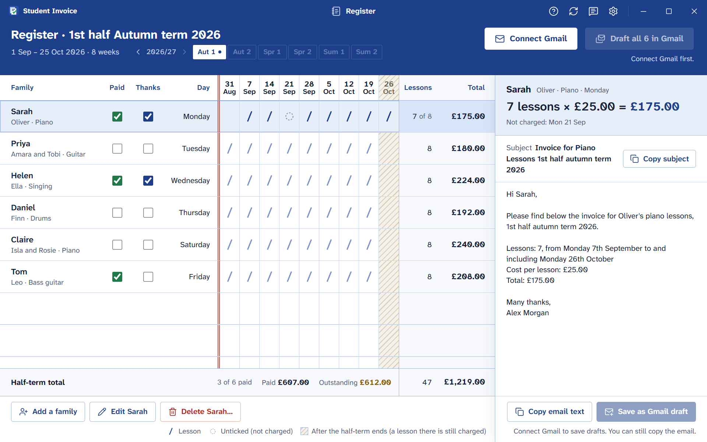
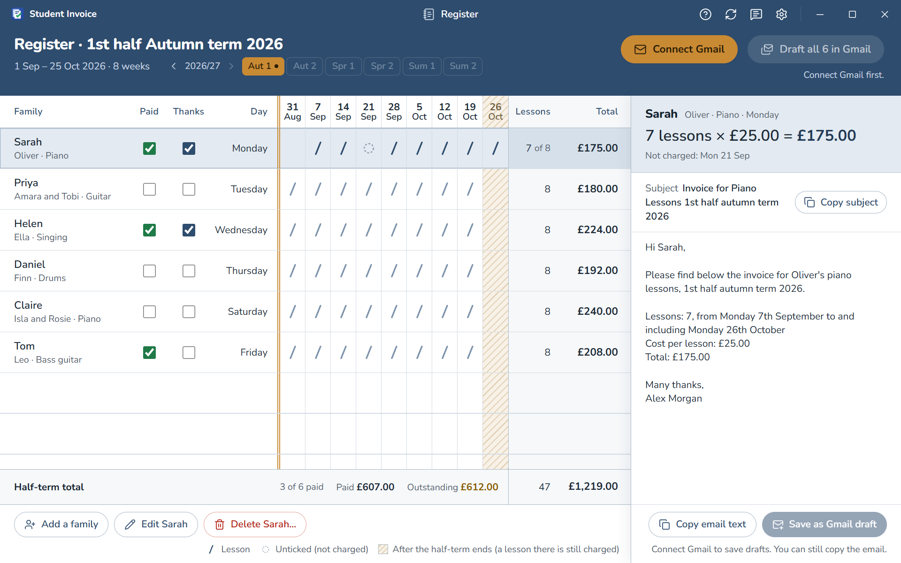

<div align="center">


# Student Invoice

**Half-term invoices for music teachers, done in one sitting.**

A small Windows app that keeps every family you teach on one register, works
out each half-term's lessons and totals, and saves the invoice emails to
Gmail as drafts for you to check and send.

[](https://github.com/WolfyCodeK/student-invoice/releases/latest)
[](https://github.com/WolfyCodeK/student-invoice/releases)
[](https://github.com/WolfyCodeK/student-invoice/actions/workflows/ci.yml)


**[Download the latest version](https://github.com/WolfyCodeK/student-invoice/releases/latest)**

</div>

<picture>
  <source media="(prefers-color-scheme: dark)" srcset="docs/images/register-dark.png">
  
</picture>

<sub>The families in the screenshots are made up.</sub>

## What it does

- **One register per half-term.** Every family is a row, every lesson is a
  dated mark, and the total is at the end of the row. The app knows the usual
  UK school half-terms, so there are no dates to type. If your school's
  differ, change them once in Settings.
- **Untick a lesson that didn't happen.** Click its mark, and the lesson count,
  total and dates in the email all follow.
- **Invoice emails written for you.** Each family's email is ready to copy, or
  to save as a Gmail draft. **Draft all** does the whole half-term at once and
  shows each family's progress. Nothing is ever sent without you.
- **Your wording, your name.** Every email is signed with your name, typed
  once. Change the email text in Settings; placeholders fill in names,
  lessons and totals.
- **Looks the way you like.** Choose the Student Invoice colours or Navy and
  amber, square or rounded corners, and light or dark.
- **Your data stays yours.** It's kept on your PC, backed up automatically
  every day, and can be moved to another PC with Export and Import.
- **Keeps itself up to date.** New versions install from inside the app, and
  a short "What's new" appears after each update.



## Getting started

1. Download the installer (`Student.Invoice_x.y.z_x64_en-US.msi`) from the
   [latest release](https://github.com/WolfyCodeK/student-invoice/releases/latest)
   and run it.
2. Windows may say it "protected your PC", because the installer isn't signed
   with a paid certificate. Choose **More info**, then **Run anyway**.
3. Add your name and your families, then **Connect Gmail**. If Google says
   the app isn't verified, choose **Advanced**, then continue. The app asks
   only for Google's drafts permission, which can't read your inbox, and it
   never sends anything itself: every draft waits in Gmail for you.
4. At each half-term: untick any lessons that didn't happen, press **Draft
   all**, then check and send the drafts from Gmail.

A guided tour shows you round the first time, and the **?** button in the
title bar replays it.

**Needs** Windows 10 or 11 (64-bit). The installer adds Microsoft Edge WebView2
if it's missing.

## Privacy

- Your families, settings and backups are stored only on your PC.
- Gmail access is limited to Google's drafts permission (`gmail.compose`):
  the app creates drafts and never reads your inbox or sends email itself.
  The sign-in token is kept in
  Windows Credential Manager and never leaves your PC except to talk to
  Google.
- The app contacts three services: Google (sign-in and drafts), GitHub
  (update checks and downloads, with signed updates) and EmailJS (only when
  you send feedback from the app).

## Updates and versions

Updates are signed, and the app checks them before installing. You can keep
using an older version if you prefer; nothing forces an update. Every change
is listed in [CHANGELOG.md](CHANGELOG.md).

## For developers

Student Invoice is built with [Tauri 2](https://tauri.app) (Rust) and React
with TypeScript.

```
cd app
pnpm install          # also enables the repo's git hooks
pnpm tauri dev        # run the app
pnpm check            # typecheck, lint and tests
```

- **Documentation:** start at [docs/README.md](docs/README.md). Setup is in
  [docs/development.md](docs/development.md). The docs are checked
  automatically, so they stay accurate.
- **Design:** [PRODUCT.md](PRODUCT.md) describes who the app is for, and
  [DESIGN.md](DESIGN.md) the design system.
- **Releasing:** [docs/release.md](docs/release.md).
- **AI assistants:** read [CLAUDE.md](CLAUDE.md) first.

## Security

Please report security problems privately to the maintainer through
[GitHub's private vulnerability reporting](https://github.com/WolfyCodeK/student-invoice/security/advisories/new)
rather than in a public issue. How the app protects your data is described
in [docs/security.md](docs/security.md).

## Licence

Copyright © 2025–2026 WolfyCodeK. All rights reserved. The source code is
published for reference only; see [LICENSE](LICENSE). Bundled fonts and
third-party components keep their own licences.
